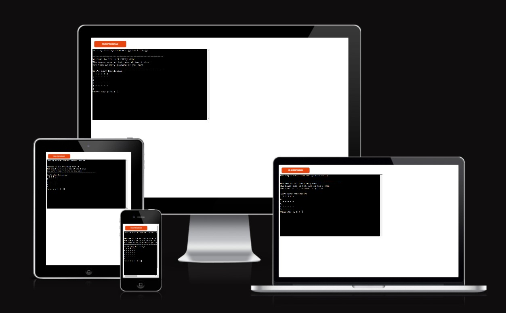
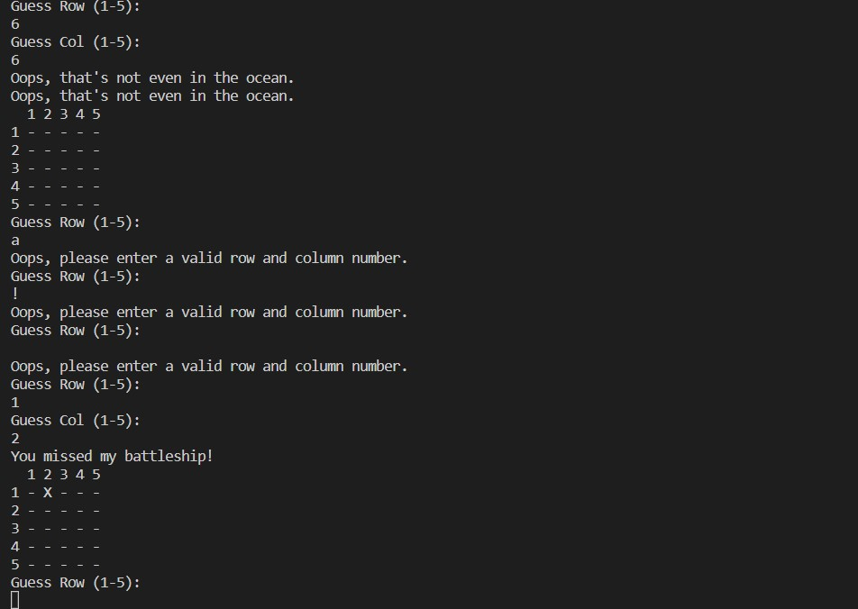

# Battleship Game

The Battleship game project is a Python program that allows the user to play the classic game of Battleship on a 5x5 board. The program uses a simple algorithm to randomly place a certain number of ships on the board, and then prompts the user to guess the location of the ships. If the user guesses the location of a ship correctly, they win the game. The program also provides feedback to the user after each guess, letting them know if they hit or missed a ship. The project can be extended to include more advanced features, such as multiple difficulty levels, multiple boards, and a graphical user interface.

## Who is this game for

The Battleship game is suitable for people of all ages who enjoy strategic guessing games. It is a fun and engaging game that can be enjoyed by kids, adults, and seniors alike.
Overall, the Battleship game is a versatile and entertaining game that can be enjoyed by anyone looking for a fun and challenging guessing game.

## How to play 

- The computer will generate a 5x5 board and place a battleship on a random cell.

- Your goal is to guess the location of the battleship by calling out coordinates in the form of (row, column).

- After each guess, the computer will tell you if you've hit the battleship or missed.

- If you hit the battleship, the game is over, and you win!

- If you miss, the computer will mark the cell on the board with an 'X' to indicate that you've already guessed that spot.

- Keep guessing until you've hit the battleship, and the game is over.

- The computer will keep track of the number of turns it takes you to find the battleship.

- Good luck and have fun!

# Features

- A randomly generated board with a hidden ship location

- The ability to guess a location on the board by inputting row and column values
    - Must be a number 
    - Cannot ipnut the same number twice
    - One cannot place coordinates that fall outside the size of the game board.

- Feedback on the guessed location, including whether the guess is a hit or a miss

- The ability to see the number of turns it took to guess the location of the ship

- The ability to see all guesses made so far in the game.

# Future Features

- Allow for more than one player to participate in the game (two player)
- Implement the ability for players to manually place their ships on the board.
- Limited the player guesses.

# Data Model

The Battleship game consists of a 5x5 game board represented by a 2D list, a ship represented by its row and column coordinates, the number of turns taken by the player, and a list of the player's guesses represented by their row and column coordinates. 

The game board is initialized with dashes ('-') and the ship is placed randomly on the board. The player makes a guess by entering a row and column number, and the game checks if the guess is a hit or a miss. If the guess is a hit, the player wins the game, and if the guess is a miss, the player continues to make guesses until they sink the ship or run out of turns. The game ends when the player sinks the ship or runs out of turns.

The class Battleship that represents the game itself. The __ init __ method initializes the board, the ship's position, the number of turns taken, and the list of guesses made by the player. The place_ship method randomly sets the position of the ship on the board.

The print_board method prints the current state of the board to the console.

The make_guess method takes a row and column as arguments and checks if there is a ship at that location on the board. It increments the number of turns taken, and if the guess is correct, it returns True. If the guess is incorrect, it prints a message to the console and adds an "X" to the board at the guessed position. It returns False.

The play_game function initializes a new Battleship instance, prints the board to the console, and then prompts the player to make a guess. It calls the make_guess method and keeps prompting the player until they guess correctly. Once the player wins, it prints the number of turns taken and a list of all the guesses made by the player.

Overall, the code is a simple implementation of the classic game Battleship, where the player tries to guess the position of a hidden ship on a 5x5 grid.

# Testing

- I have manually tested the code 
- I bugged tested the code using PEP8 liner and no error were confimed
- Tested my code on my GitPod and Heroku terminal

## Bug 
  
  - I was getting a ValueError because the input function was returning an empty string instead of a valid integer value. So I added a try/except block around the input statements to catch the ValueError and prompt the user to enter a valid input.
  
  ## Remain Bugs

   - Occaisionally a bug will show were there is no ship. I've repeatedly troubleshooted this issue and can not resolve.

  ## Validator 

# Resources
- [Code Institute](https://codeinstitute.net/) Course material
- [W3Schools]( https://www.w3schools.com/) 
- [Am I Responsive](http://ami.responsivedesign.is/) – Check the sites responsiveness
- [CI Python Linter](https://pep8ci.herokuapp.com/#) Validate Python code

# Version Control 

- Heroku
- GitHub
- Gitpod

Heruko for project deplyment
Gitpod served as the local repository and IDE. 
GitHUb served as the remote repository. 

The following steps were followed to maintain version control;

- I created a repository on GitHub and named it 'Battleship' 
- I then signed in to Gitpod and opened a new workspace via the repository name 'Battleship'
- I saved my work on GitPod at regular intervals and pushed it to GitHub to keep it safe

This is the process I followed having completing each significant section of code, I typed the following into the terminal:
- git add . (This added the work to git)
- git commit -m "COMMIT MESSAGE" (This committed the work)
- git push (This pushed the work to GitHub)

# Deployment 

I followed the below steps on Heroku (insert link) to deploy the website. 

- On my Heroku Dashboard, create new app.
- Under Setting, builpack I added two pack 
  - heruko/python
  - heruko/nodjs
- Under Deploy tab
  - Connect my GitHub account
  - Search for a repository to connect to (repository name)

